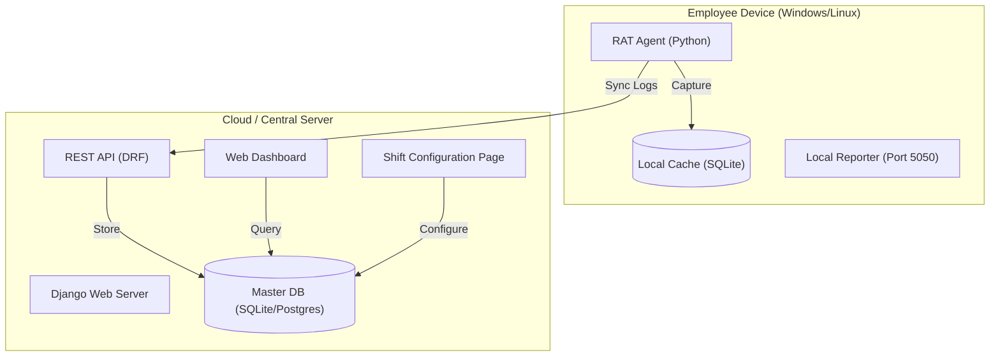

# System Architecture - Project RAT

This document describes the high-level architecture and technology stack of the Remote Activity Tracker (RAT) system.

## Overview

Project RAT is an enterprise-grade monitoring system designed to track employee productivity and detect security threats across Windows and Linux environments. It follows a decoupled Client-Server architecture.

## Core Components

### 1. RAT Agent (`rat_agent`)
The agent is a multi-threaded Python application responsible for telemetry collection.

- **Technology**: Python 3.x, `psutil`, `pynput`, `requests`, `djangorestframework`, `waitress`.
- **Functionality**:
    - **Offline-First**: Uses a local SQLite database to buffer logs when the server is unreachable.
    - **Multi-threaded & High Throughput**: Discrete threads for application monitoring, idle detection, and security scanning. The **Concurrent Sync Manager** uses a thread pool to handle high-volume data uploads in parallel chunks.

### 2. RAT Cloud (`rat_web`)
The server serves as the data aggregator and visualization hub.

- **Technology**: Django 5.x, Django REST Framework (DRF), SQLite.
- **Functionality**:
    - **Centralized Storage**: Stores all historical logs from all registered devices.
    - **Advanced Analytics**: Calculates productivity scores, identifies context-switching spikes, and flags security risks.
    - **Role-Based Reporting**: Provides deep-dive views into individual device activity and organization-wide trends.

## Data Flow Summary

1. **Collection**: Agent monitors capture system events (Window changes, I/O spikes, USB insertion).
2. **Persistence**: Events are saved immediately to `local_logs.db`.
3. **Synchronization**: The `SyncManager` thread batch-uploads unsynced logs to the Server via HTTP.
4. **Processing**: The Server processes raw logs, updates device status, and calculates risk weights.
5. **Visualization**: Managers view real-time metrics and historical reports via the Web Dashboard.

## Network Requirements

- **Server Port**: Default `8000` (Django).
- **Agent Local Port**: Default `5050` (Local Reporter).
- **Connectivity**: Agent requires outbound HTTPS (or HTTP) access to the Server's URL.
